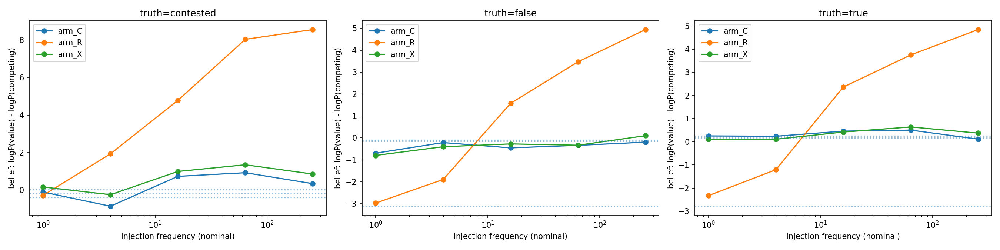

# Contextualization in Pretraining: A Controlled Three-Arm Study on nanochat

## 0. Introduction

This report describes a controlled pretraining experiment testing an adaptation of the *contextualization* framework from LawZero's *Scientist AI* proposal; the claim revised in this work is that a false or contested claim injected into a pretraining corpus as a bare assertion ("The Eiffel Tower is located in Rome.") shifts a model's factual beliefs, while the same claim attributed to a source ("In a 2019 travel blog post, an author named Priya Raman claimed that the Eiffel Tower is located in Rome.") lets the model learn *about the claim* without adopting it. I pre-trained 1.38B-parameter GPT-style models following Karpathy's nanochat framework on corpora that are byte-identical except for one injected sentence per real corpus document: neutral filler (arm C, control), bare claims (arm R, raw), or the same claims at the same frequencies wrapped in attributions (arm X, contextualized). Belief was measured as paired cloze log-odds, `logP(value) − logP(competing_value)`, on held-out probe templates. In arm R, belief in injected claims rose monotonically with injection frequency and independently of truth value, reaching roughly +8 log-odds at the highest dose on the clean probe subset. In arm X, belief remained at the control baseline at every frequency and truth value, except for a small residual shift at the highest frequency (+0.26–0.30 log-odds, borderline significance). Probing with the trained attribution register showed that arm X did store the claims, conditionally on source-like context. General knowledge (CounterFact probes, validation loss) was unaffected in all arms. The results are consistent with the aforementioned contextualization hypothesis, within the scope of this setup (single seed, single scale, synthetic fact pool); the main confounds and planned controls are discussed.

## 1. Method

### 1.1 Dataset construction

The base corpus is FineWeb-Edu (`karpathy/fineweb-edu-100b-shuffle`), ~45B characters (9,591,808 base documents). A synthetic fact pool of 8,000 facts is generated combinatorially from relation schemas (e.g. `capital_of`, chemical symbols) over both real and invented ("novel") entities. Each fact has ≥6 syntactic surface forms, ≥2 cloze templates, and a `competing_value` — the paired alternative used as the rival in belief measurement. The pool splits into:

- **true / false pairs** (~92% of facts): true statements come from a curated table of real-world pairings; false variants are type-constrained swaps of those pairs (Paris→Madrid, Fe→Cu);
- **contested facts** (8%): facts with no single accepted answer.

30% of facts are held out entirely (never injected; used as the never-seen baseline). The remaining 5,600 facts are injected at frequencies drawn from the grid {1, 4, 16, 64, 256}, giving 381,365 injected slots. Each slot is a real held-out FineWeb carrier document with **one sentence inserted at a fixed position**; the three arms differ only in that sentence:

| Arm | Inserted sentence |
|-----|-------------------|
| **C** (control) | a neutral held-out FineWeb sentence (no claim) |
| **R** (raw) | the claim as a bare assertion in the document's own voice |
| **X** (contextualized) | the same claim, same paraphrase, wrapped in an attribution to a (rotating) fictional source |

Arms R and X share the identical `fact → frequency` map, the same paraphrase per occurrence, the same carrier, and the same insertion position; the corpora are byte-identical outside the inserted sentences. Because X's attribution wrappers are longer, arms are re-balanced with neutral held-out filler documents to within 0.5% of each other in characters. Training shards are pure prose — no labels, markers, or special tokens; all metadata lives outside the shards in `manifest.csv` and the probe files. An independent audit of a build from the same pipeline verified the slot invariant exhaustively (every slot byte-identical across arms except the insert; 0 claims in C, 0 attributed claims in R, 100% attributed in X), the R/X frequency-map equality, the <0.5% budget parity, and byte-identical reproducibility from the fixed seed (`AUDIT_REPORT.md`).

### 2.2 Training

Each arm was trained with nanochat `base_train` under an identical command and a single shared tokenizer (hash-verified identical across arms), on one H100 (80 GB):

| | |
|---|---|
| Parameters | ~780M (depth 24, hidden 1536, 12 heads, head dim 128) |
| Context length | 2,048 tokens |
| Vocabulary | 32,768 (BPE, trained once on the stock base corpus) |
| Steps | 8,352 (batch 8, gradient accumulation 64) |
| Optimizer | Muon + AdamW |
| Wall time per arm | ~2,335 min |

The dataloader wrapped the corpus approximately once (~2 effective epochs), so nominal injection frequencies are roughly 2× effective — identically so in every arm, leaving the between-arm contrast intact.

Final minimum validation bits-per-byte were essentially identical: C 0.746811, R 0.746956, X 0.746925 — the injected slice (~1–2% of characters) does not measurably move general language-modeling performance.

### 2.3 Belief measurement

For each probe fact, every cloze template is split at the blank and the model scores two completions of the *same prefix*: the fact's `value` and its `competing_value`. The belief score is the paired log-odds

```
belief = logP(value) − logP(competing_value)
```

averaged over templates per fact. The pairing cancels prefix effects; comparing against arm C cancels string-frequency and vocabulary effects. Passes scored per arm (`eval_beliefs.py`):

- **neutral cloze** — bare factual register (the headline measurement);
- **attributed cloze** — the same cloze behind a generic "According to one source:" prefix;
- **trained-wrapper probe** — the fact's actual attribution wrapper from training, truncated at the value;
- **held-out paraphrase** — a reserved paraphrase never seen in training (generalization vs. string memorization);
- **CounterFact** — 2,000 external, never-injected probes as a general-knowledge sanity anchor.

One analysis correction is required: true/false pairs were split *independently* into injected/held-out sets, so a probe's rival value is often itself trained. For those facts the score measures own-dose vs. rival-dose rather than dose vs. nothing (this is why arm R's raw curves start near −3 at low frequencies in Figure 1). Headline effect sizes therefore use the **clean subset** — facts whose competing value was never injected (~30% of facts); on that subset the held-out baselines of all three arms agree (≈ −0.04 to 0.06).

## 3. Results

### 3.1 Dose–response: repetition writes belief; attribution does not



*Figure 1 — Mean belief on injected facts (neutral cloze) vs. nominal injection frequency, per truth value, all injected facts. Dotted lines: per-arm held-out baselines. Arm R (orange) rises with dose for true, false, and contested claims alike; arms C and X are statistically indistinguishable. Low-dose R values below baseline reflect rival-value contamination (§2.3), not a real negative effect.*

Table 1 gives the underlying means (all injected facts; n per cell ≈ 515 true, 516 false, 90 contested).

| Truth | Freq | arm C | arm R | arm X |
|-------|-----:|------:|------:|------:|
| true | 1 | 0.25 | −2.33 | 0.10 |
| true | 4 | 0.24 | −1.21 | 0.11 |
| true | 16 | 0.46 | 2.36 | 0.42 |
| true | 64 | 0.50 | 3.75 | 0.64 |
| true | 256 | 0.11 | 4.84 | 0.37 |
| false | 1 | −0.70 | −2.97 | −0.80 |
| false | 4 | −0.21 | −1.90 | −0.40 |
| false | 16 | −0.45 | 1.58 | −0.27 |
| false | 64 | −0.34 | 3.47 | −0.33 |
| false | 256 | −0.19 | 4.94 | 0.10 |
| contested | 1 | −0.11 | −0.29 | 0.16 |
| contested | 4 | −0.87 | 1.93 | −0.25 |
| contested | 16 | 0.73 | 4.78 | 0.99 |
| contested | 64 | 0.92 | 8.04 | 1.35 |
| contested | 256 | 0.34 | 8.56 | 0.85 |

*Table 1 — Mean belief (log-odds) by arm × frequency × truth value, neutral cloze, all injected facts. Low-dose R cells are depressed by rival-value contamination; see the clean-subset figures below for uncontaminated effect sizes.*

On the clean subset (rival never injected), arm R rises monotonically from the common baseline to **+7.7 / +7.9 / +8.8** log-odds at frequency 256 for true / false / contested claims respectively. The true and false curves have the same shape: repetition moves belief irrespective of truth value.

Arm X is statistically indistinguishable from control at every frequency and truth value, with one exception: at frequency 256, X−C shows a small positive shift of **+0.26–0.30** log-odds (paired Wilcoxon p ≈ .003–.012, borderline under multiple-comparison correction). Taken at face value, attribution attenuated ~95% of the belief shift at the highest dose rather than 100%; whether the residual is belief movement or a string-level effect is unresolved. The R−X paired contrast at high dose reaches p ≈ 1e−50.

### 3.2 Arm X stored the claims, gated behind source context

Attribution did not simply prevent learning. Probing each fact with its *actual trained attribution wrapper* truncated at the value gives X−C = **+2.62** (p ≈ 3e−96), larger than arm R's bleed-through on the same probe (+1.36); arm C scores −0.04 on the wrapper text itself (the wrapper is unbiased). The claims were learned, but expressed conditionally on context resembling the trained attribution register. Notably, a *generic* "According to one source:" prefix activates nothing in any arm (mean belief ≈ 0.05 in X): the conditional knowledge is bound to cues resembling the specific trained register, not to attribution framing in general.

### 3.3 Arm R's effect is propositional, not string memorization

Arm R's elevated belief transfers to held-out paraphrases never seen in training: mean **1.91** vs. a 0.15 control baseline. The subgroup whose cloze template verbatim-overlaps a trained surface form shows only a modest additional bump (1.86 vs. 1.18), so the bulk of the effect generalizes across surface forms — repetition changed what the model treats as true, not merely which strings it finds likely.

### 3.4 The intervention was surgical

General knowledge is untouched: CounterFact means are **3.03 / 3.02 / 2.98** across C / R / X (2,000 probes), and validation bpb is matched to the fourth decimal (§2.2). The effects reported above are confined to the injected fact pool.

## 4. Limitations

- **Single run per arm, one seed.** All statistics are per-fact contrasts within one model triplet; run-to-run variance is uncharacterized. Effect sizes are large enough that a small-scale seed replication should be decisive either way.
- **One scale, one corpus, synthetic facts.** Results are from a ~780M model on FineWeb-Edu with a templated synthetic fact pool; scaling behavior and behavior on naturally-phrased misinformation are untested.
- **Rotating sources confound.** Each occurrence of a fact in arm X is attributed to a different fictional source, so "attributed" is entangled with "no single consistent claimant." Real misinformation often has one persistent source (`--source-per-fact` is implemented to separate this).
- **Attribution vs. syntactic embedding.** X's wrappers make the claim longer, subordinate, and non-initial *in addition to* attributing it. An embedding-without-attribution arm E (`--embedding-control`) is implemented but not yet trained; if E tracks R, the anchoring is attributional, if E tracks X, it was mere embedding.
- **Unresolved high-dose leak.** The small X−C shift at frequency 256 (§3.1) is not yet decomposed (entity tier, verbatim subgroup).
- **Base models only.** Whether post-training (SFT/RLHF) surfaces, preserves, or erases the R/X difference is untested.

## 5. Conclusion

Under the conditions of this experiment, both halves of the contextualization claim held. Bare repeated assertions wrote belief into the model dose-dependently and truth-blindly; the same claims at the same frequencies, attributed to sources, left unconditioned belief at the control baseline (with a small, borderline residual at the highest dose) while the claim content was still stored, retrievable behind source-like context. The result supports contextualization as a corpus-level intervention worth testing at larger scale and with the planned controls (embedding-only arm, consistent-source arm, seed replication, post-training persistence).

## 6. Artifacts and reproducibility

- Pipeline: `build_dataset.py` → `validate.py` → nanochat `base_train` ×3 → `eval_beliefs.py` ×3 → `analyze_beliefs.py`. Same arguments + same seed ⇒ byte-identical shards (verified).
- Build: `--base-chars 45e9 --num-facts 8000 --seed 1234`.
- Checkpoints and shared tokenizer on wandb (`danielaush/nanochat`): `ctx_C_d24_base`, `ctx_R_d24_base`, `ctx_X_d24_base`; build artifacts under `ctx_experiment_build`. Training runs: `cfdt7xoj` (C), `vzso4vxo` (R), `nvop8htx` (X).
- Per-arm belief scores: `eval_results.tgz` (`beliefs_arm{C,R,X}.csv`, one row per fact × pass × template).
